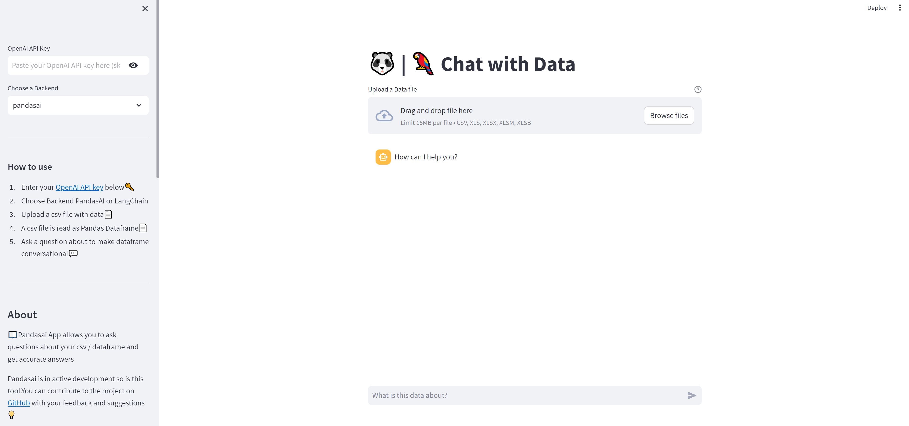

<h1 align="center">
📖Chat with Data
</h1>

An App to interact with Pandas Dataframes using Generative AI (LLMs). This app is built using `streamlit`
as front end and using [`pandasai`](https://github.com/gventuri/pandas-ai) a higher level python wrapper to make dataframes conversational.

[](https://youtu.be/WZKyMkSyVt0)

## 🔧 Features
- Upload csv 📁(csv) and ask questions about the uploaded Data.
- Ask Questions about the data
- Interact with your data like a Human

## 💻 Running Locally

1. Clone the repository📂

```bash
git clone https://github.com/amjadraza/chat-with-data.git
```

2. Install dependencies with [Poetry](https://python-poetry.org/) and activate virtual environment🔨

```bash
poetry install
poetry shell
```

3. Run the Streamlit server🚀

```bash

streamlit run demo_apps/langchain_app.py 
```

Run App using Docker
--------------------
This project includes `Dockerfile` to run the app in Docker container. In order to optimise the Docker Image
size and building time with cache techniques, I have follow tricks in below Article 
https://medium.com/@albertazzir/blazing-fast-python-docker-builds-with-poetry-a78a66f5aed0

Build the docker container

``docker  build . -t chat-with-data:latest``

To generate Image with `DOCKER_BUILDKIT`, follow below command

```DOCKER_BUILDKIT=1 docker build --target=runtime . -t chat-with-data:latest```

1. Run the docker container directly 

``docker run -d --name chat-with-data -p 8000:8000 chat-with-data:latest ``

2. Run the docker container using docker-compose (Recommended)

``docker-compose up``

Deploy App on Streamlit Public Cloud
-------------------------------------

Belo are the steps to deploy a Streamlit App on Streamlit Public Cloud

1. Create a Streamlit App:
Develop your Streamlit app and ensure it's working as expected on your local machine.

2. Push to GitHub:
Upload your Streamlit app code to a GitHub repository if it's not already there. Make sure to include all necessary files and dependencies.
3. Connect to Streamlit Sharing:
Visit Streamlit Sharing and sign in with your GitHub account.

4. Select Repository:
Click on "New App" and select your GitHub repository containing the Streamlit app.

5. Deploy Your App:
Streamlit Sharing will automatically detect your app's settings. Click "Deploy" to start the deployment process. Once complete, you'll receive a public URL to access your Streamlit app.


Deploy App on Google Cloud using Cloud Run (RECOMMENDED)
--------------------------------------------------------
This app can be deployed on Google Cloud using Cloud Run following below steps.

## Prerequisites

Follow below guide on basic Instructions.
[How to deploy Streamlit apps to Google App Engine](https://dev.to/whitphx/how-to-deploy-streamlit-apps-to-google-app-engine-407o)

We added below tow configurations files 

1. `cloudbuild.yaml`: A Configuration file for `gcloud`
2. `.gcloudignore` : Configure the file to ignore file / folders to be uploaded

we are going to use `Dockerfile` to deploy the app using Google Cloud Run.

1. Initialise & Configure the Google Project using Command Prompt

- gcloud init
- gcloud auth login 

YOUR_PROJECT_ID = "datafy-chat-app"

- Create a project on GCP using below command

`gcloud projects create datafy-chat-app --name="Chat App" --labels=type=workshop`

- Set the Project

`gcloud config set project datafy-chat-app``

- Set the Region & Zone
`gcloud config set compute/zone australia-southeast1``

-List the available zones
`gcloud config list compute/zone`

>Make Sure to enable the Billings on Google Cloud Project using Console


2. Enable Services for the Project Cloudbuild

```
gcloud services enable cloudbuild.googleapis.com
gcloud services enable run.googleapis.com
```

3. Create Service Account

We have to create a service account to be able to provide acess

chat-app-tutorial

```
gcloud iam service-accounts create sa-chat-app-tutorial --display-name="chat-app-tutorial"

gcloud projects add-iam-policy-binding datafy-chat-app\
    --member="serviceAccount:sa-chat-app-tutorial@datafy-chat-app.iam.gserviceaccount.com" \
    --role="roles/run.invoker"

gcloud projects add-iam-policy-binding datafy-chat-app \
    --member="serviceAccount:sa-chat-app-tutorial@datafy-chat-app.iam.gserviceaccount.com" \
    --role="roles/serviceusage.serviceUsageConsumer"

gcloud projects add-iam-policy-binding datafy-chat-app \
    --member="serviceAccount:sa-chat-app-tutorial@datafy-chat-app.iam.gserviceaccount.com" \
    --role="roles/run.admin"
``` 

4. Generate the Docker

`DOCKER_BUILDKIT=1 docker build --target=runtime . -t australia-southeast1-docker.pkg.dev/datafy-chat-app/datachatapp/chat-with-data:latest`

5. Push Image to Google Artifact's Registry

Create the repository with name `datachatapp`

```
gcloud artifacts repositories create datachatapp \
    --repository-format=docker \
    --location=australia-southeast1 \
    --description="A Chat with Data App" \
    --async
```

Configure-docker 

`gcloud auth configure-docker australia-southeast1-docker.pkg.dev`

In order to push the `docker-image` to Artifact registry, first create app in the region of choice. 

Check the artifacts locations

`gcloud artifacts locations list`


Once ready, let us push the image to location

`docker push australia-southeast1-docker.pkg.dev/datafy-chat-app/datachatapp/chat-with-data:latest`

6. Deploy using Cloud Run

Once image is pushed to Google Cloud Artifacts Registry. Let us deploy the image.

```
gcloud run deploy chat-data-llm --image=australia-southeast1-docker.pkg.dev/datafy-chat-app/datachatapp/chat-with-data:latest \
    --region=australia-southeast1 \
    --service-account=sa-chat-app-tutorial@datafy-chat-app.iam.gserviceaccount.com \
    --port=8000
```

7. Test the App Yourself

You can try the app using below link 

[LINK]


## 🚀 Upcoming Features

- [x] Some Generic insights on Uploaded Data (e.g Shape, head etc)
- [x] Adding Docker Support to run the App in Docker
- [ ] Push Docker Image to DockerHub for Public use
- [x] Deploying App on Google Cloud Run

## Report Feedbacks

As `pandasai` is in active developments as well as LLMs sometime go south. 
Please report your feedbacks for improvements. 

## DISCLAIMER

The Pandasai app (hereinafter referred to as "the App") is provided for informational purposes only. 
The creators and authors of the App make no representations or warranties of any kind, 
express or implied, about the completeness, accuracy, reliability, suitability, 
or availability of the App or the information, products, services, 
r related graphics contained in the App.

We do not store any of data or API keys. Users can refresh Keys as part of Best Practices.

This disclaimer is subject to change without notice. It is your responsibility to review this disclaimer periodically 
for any updates or changes.